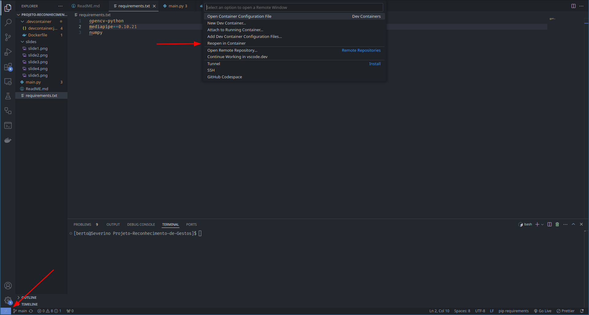

## **⚠️ Requerimentos**

1. **Webcam**

- Para a execução adequada do programa, é necessário uma Webcam conectada ao dispositivo.
- Quando não há Webcams disponíveis, o Docker vai retornar um erro
- Caso a Webcam esteja conectada, mas não está sendo reconhecida, verificar o caminho da Webcam na linha `--device=/dev/video0` do arquivo devcontainer.json

2. **Python e Dependências**

- As bibliotecas necessárias estão disponíveis no requirements.txt
- É necessário que a versão do python seja entre 3.07 até 3.10 para utilizar a biblioteca mediapipe

# Como Rodar

Tendo em vista os requerimentos necessários...

Primeiramente, clone o repositório:

`git clone https://github.com/humbertomcar/Projeto-Reconhecimento-de-Gestos.git`

## Docker

### Pré-requisitos
- Docker instalado
- Extensão do Docker instalado no VS Code

1. É necessário construir o container do Docker:

`docker build -t dockerfile .`

2. Em seguida, vamos abrir o programa no container criado:

3. basta executar o comando `python3 main.py` no diretório do projeto, e pronto!

## Ambiente Virtual (venv)
Caso opte em não utilizar o Docker, você pode utilizar o próprio venv

Certifique-se de que a versão do seu Python é compatível com a biblioteca mediapipe (Python 3.7 - 3.10)

### Criar o ambiente virtual:

`python -m venv .venv`

No diretório do projeto, ative o ambiente virtual:

**Linux**

`source .venv/bin/activate`

**Windows**

`.venv/Scripts/activate`

### Instalar as bibliotecas necessárias:

`pip install -r requirements.txt`

Lembre-se de utilizar o executável do python presente no ambiente virtual criado, e pronto!